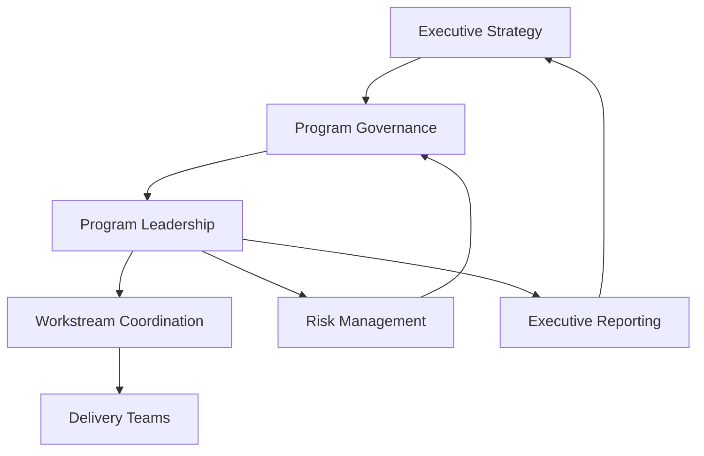
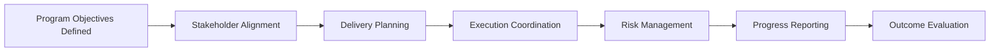

# Program Execution OS

Part of the **Transformation Operating System** framework.

See the architecture overview:  
https://github.com/somerwalker/transformation-operating-system

A practical operating system for running complex technology programs.

Large initiatives often struggle not because the work is impossible, but because coordination across teams becomes difficult. Dependencies multiply, priorities shift, and communication breaks down.

Program Execution OS introduces a structured model for managing large initiatives with clear governance, communication rhythms, and delivery discipline.

---

# Common Reasons Programs Struggle

Many complex initiatives fall behind or lose momentum due to organizational rather than technical problems.

Common obstacles include:

- unclear ownership and decision authority  
- weak coordination across teams  
- inconsistent communication with stakeholders  
- unmanaged dependencies  
- late identification of risks and blockers  
- lack of executive visibility into program health  

This framework addresses those challenges by introducing practical structures for program intake, governance, cross-team coordination, risk management, and executive reporting.

---

# Guiding Principles

### 1. Start with clarity
Programs require clear objectives, scope, ownership, and success criteria before execution begins.

### 2. Establish decision structure early
Governance works best when decision rights and escalation paths are defined before major issues arise.

### 3. Coordinate across teams intentionally
Cross-team delivery should be managed through explicit dependency tracking, shared milestones, and communication rhythms.

### 4. Surface risks early
Strong programs identify risks, blockers, and tradeoffs early enough to act on them.

### 5. Communicate with purpose
Reporting should help teams make decisions, remove blockers, and maintain momentum.

---

# Core Execution Model

Program Execution OS structures complex initiatives around five execution pillars:

1. **Program Definition**  
   Clear scope, ownership, and success criteria.

2. **Governance and Decision Authority**  
   Structured oversight and escalation paths.

3. **Cross-Team Coordination**  
   Dependency tracking and milestone alignment.

4. **Risk and Issue Management**  
   Early identification and mitigation of delivery risks.

5. **Executive Visibility**  
   Consistent reporting that supports leadership decision-making.

---
   
## Execution Architecture

Program Execution OS organizes complex initiatives around clear layers of coordination and decision-making.

---

# Example Workflow

---

# When to Use This Framework

Program Execution OS is designed for complex initiatives that require coordination across multiple teams, stakeholders, and technical systems.

This framework is particularly useful when:

- managing large infrastructure or platform initiatives  
- coordinating delivery across multiple engineering teams  
- running enterprise transformation programs  
- aligning technical delivery with executive strategy  
- establishing governance for cross-functional initiatives  

Programs that involve multiple teams, shared dependencies, and executive oversight benefit from clear operating structures that guide coordination, decision-making, and reporting.

---

# Repository Contents

This repository contains practical frameworks, templates, and examples for coordinating complex programs with structure and accountability.

---

## Documentation

| File | Description |
|-----|-------------|
| `docs/01-program-intake.md` | Framework for defining program objectives, stakeholders, scope, and success criteria |
| `docs/02-governance-model.md` | Governance structure for decision-making, escalation, and executive oversight |
| `docs/03-cross-team-coordination.md` | Approaches for managing dependencies, milestones, and communication across teams |
| `docs/04-risk-management.md` | Practical methods for identifying, tracking, and mitigating program risks |
| `docs/05-executive-reporting.md` | Guidance for communicating program health, progress, and issues to leadership |
| `docs/06-delivery-cadence.md` | Recommended meeting rhythms and delivery checkpoints for complex programs |

---

## Templates

| File | Description |
|-----|-------------|
| `templates/program-intake-template.md` | Template for defining a new program before execution begins |
| `templates/risk-register-template.md` | Template for documenting and tracking program risks |
| `templates/stakeholder-map-template.md` | Template for mapping stakeholders, influence, and engagement approach |
| `templates/executive-status-update-template.md` | Executive reporting template for program health and decision support |

---

## Examples

| File | Description |
|-----|-------------|
| `examples/example-program-charter.md` | Example program definition showing scope, objectives, and success criteria |
| `examples/example-risk-register.md` | Example risk register illustrating how program risks can be tracked |
| `examples/example-steering-committee-agenda.md` | Example governance meeting agenda for steering committee oversight |

---

# How This Framework Helps Organizations

Organizations running complex technology initiatives often struggle with coordination and visibility across teams.

Program Execution OS introduces structures that help leaders bring clarity and discipline to large initiatives.

This framework helps organizations:

- align teams around shared objectives and milestones  
- establish clear decision authority and governance  
- surface risks earlier in the delivery lifecycle  
- improve executive visibility into program progress  
- maintain delivery momentum across multiple teams  

When applied consistently, these practices improve predictability, accountability, and collaboration across complex programs.

---

# Future Improvements

Future updates may include:

- additional real-world program examples  
- expanded templates for dependency tracking  
- sample executive dashboards  
- guidance for scaling governance in large organizations  
- integration with AI transformation operating models  

Contributions and suggestions are welcome.

---

# Contributing

Contributions are welcome. If you have ideas for improving the frameworks, templates, or examples in this repository, please review the contribution guidelines in [`CONTRIBUTING.md`](CONTRIBUTING.md) and open an issue or pull request.

---

# Author

**Somer Walker**  
Enterprise Program Leader | AI Transformation | Operational Excellence

Background leading large-scale infrastructure, cloud, and AI initiatives across global organizations. Focused on turning strategy into disciplined execution.

LinkedIn  
https://www.linkedin.com/in/somerwalker
