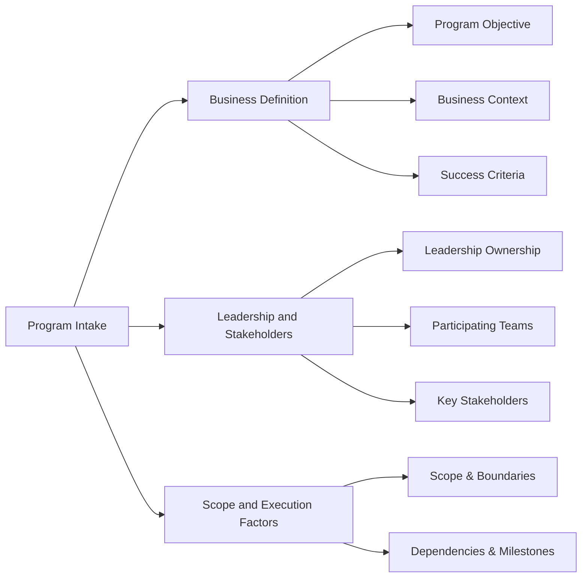

# Program Intake

This guidance helps leaders define a program clearly before execution begins within the Program Execution OS model.

Complex initiatives often begin with broad ambition but insufficient definition. A structured intake process helps clarify the objective, scope, ownership, and success criteria before teams begin execution.

## Intake Definition

Program intake defines the core information required to understand and govern a program before execution begins.

The intake structure typically covers three areas:

- **Business Definition** — why the program exists and what success looks like  
- **Leadership and Stakeholders** — who owns the program and who must be involved  
- **Scope and Execution Factors** — the boundaries, dependencies, and timeline influences that shape delivery

Together, these elements establish the shared understanding required to begin planning, governance, and delivery coordination within the Program Execution OS.

## Why Intake Matters

Program intake helps organizations:

- align stakeholders early
- reduce ambiguity
- define ownership
- identify key dependencies
- establish a foundation for governance and reporting

Well-defined programs are easier to coordinate, measure, and govern.

## From Intake to Program Charter

Once program intake information has been reviewed and stakeholders are aligned on the program objective and scope, the next step is formalizing the initiative through a **Program Charter**.

The program charter defines the program at a high level and establishes the leadership, scope boundaries, and success criteria that will guide execution. Unlike detailed delivery plans, the charter focuses on clarifying purpose, ownership, and expected outcomes before execution structures are applied.

Typical charter elements include:

- program objective
- business context
- scope boundaries
- executive sponsor
- program lead
- participating teams
- success criteria
- high-level timeline or phases

The charter serves as the foundation for the governance, coordination, and reporting structures described in the Program Execution OS.

An example charter is available here:

`examples/example-program-charter.md`

---
---

Part of the **Transformation Operating Framework**

Transformation Operating Framework  
https://github.com/somerwalker/transformation-operating-framework

Copyright © 2026 Somer Walker

This material is provided for educational and professional reference.
Commercial use or derivative consulting frameworks requires permission from the author.
