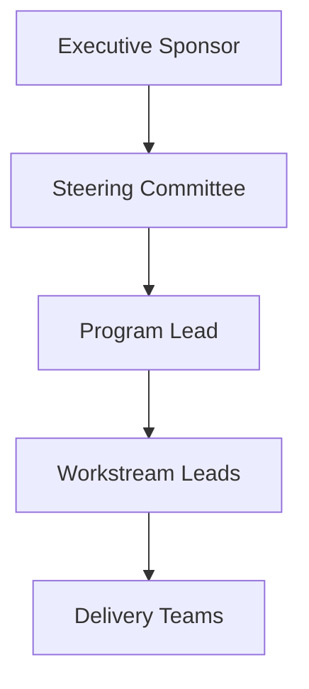
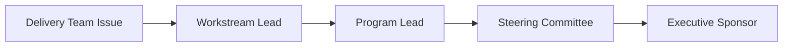

# Governance Model

This guidance describes the governance structure used to guide complex programs with clarity and accountability.

Complex programs require more than delivery plans. They require a governance model that clarifies who makes decisions, who provides oversight, and how risks and escalations are handled.

## Key Governance Roles

### Executive Sponsor
Provides strategic direction, removes major blockers, and ensures alignment with organizational priorities.

### Steering Committee
Reviews progress, addresses major risks, and approves important decisions.

### Program Lead

Coordinates execution, reporting, and stakeholder alignment across teams.

This role represents the individual responsible for overall program coordination and delivery oversight. Depending on the organization, this role may be filled by a Scrum Master, Project Manager, Program Manager, Program Director, or another delivery leadership role.

### Workstream Leads
Own delivery within specific domains or teams and escalate issues when needed.

## Governance Structure

## Governance Mechanism

Effective governance often includes:

- steering committee reviews
- decision logs
- escalation paths
- milestone reviews
- executive reporting

A clear governance model improves accountability and helps programs maintain momentum.

## Escalation Flow

---
---

Part of the Transformation Operating Framework  
https://github.com/somerwalker/transformation-operating-framework

Copyright © 2026 Somer Walker

This material is provided for educational and professional reference.  
Commercial use or derivative consulting frameworks requires permission from the author.
