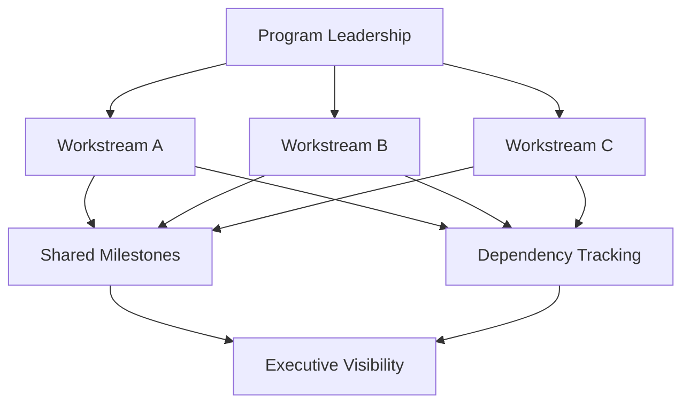
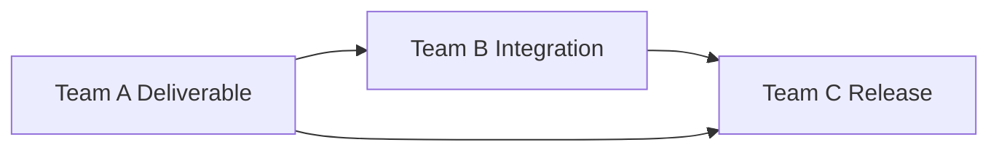

# Cross-Team Coordination

This guidance outlines how leaders coordinate delivery across multiple teams with shared milestones and dependencies.

Large programs often fail when teams work in parallel without enough alignment. Strong coordination creates visibility into dependencies, risks, and milestones across workstreams.

## Core Coordination Practices

### Shared Milestones
Define milestones that align teams around major delivery outcomes.

### Dependency Tracking
Document and monitor dependencies between teams to reduce surprises.

### Communication Rhythms
Use regular coordination meetings and status updates to maintain visibility.

### Escalation Paths
Provide clear methods for raising blockers that affect multiple teams.

## Coordination Structure

Delivery teams may be referred to differently across organizations. 
Depending on the delivery model, these teams may be called squads, pods, feature teams, or engineering teams. 
Within Program Execution OS, the term **Delivery Team** refers generically to the group responsible for implementing a defined portion of program work.

## Dependency Chains

The diagram below illustrates a simple dependency chain across delivery teams. A dependency chain maps how deliverables from one team enable downstream work for others. The structure of the chain reflects system architecture, integration dependencies, milestone sequencing, and the order in which capabilities must be delivered.

## Benefits

Cross-team coordination helps organizations:

- reduce delivery friction
- improve predictability
- align priorities across teams
- identify blockers earlier

Programs with intentional coordination structures are better positioned to deliver at scale.

---
---

Part of the Transformation Operating Framework  
https://github.com/somerwalker/transformation-operating-framework

Copyright © 2026 Somer Walker

This material is provided for educational and professional reference.  
Commercial use or derivative consulting frameworks requires permission from the author.
