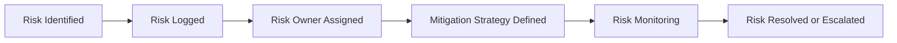

# Risk Management

This guidance describes how programs identify, monitor, and address risks before they disrupt delivery.

Every complex program involves uncertainty. The goal of risk management is not to eliminate all risk, but to create enough visibility and ownership to respond effectively.

## Common Program Risks

Examples include:

- unclear requirements
- unresolved dependencies
- resource constraints
- shifting priorities
- technical integration challenges
- delayed decisions

## Practical Risk Management

Strong programs typically:

- maintain a risk register
- assign risk owners
- review risks regularly
- define mitigation strategies
- escalate material risks early

Programs that manage risk well maintain more predictable delivery and stronger leadership confidence.

## Risk Lifecycle

A risk lifecycle describes the stages a potential issue moves through as it is identified, evaluated, monitored, and ultimately resolved or escalated during program delivery. Managing risks as part of a defined lifecycle helps ensure that uncertainties are documented, ownership is clear, and mitigation actions are tracked before problems affect delivery.

The lifecycle above represents a simplified view of program risk management. Some organizations operate more complex risk governance processes involving additional review stages, risk committees, or compliance functions. This model focuses on the core activities required to maintain visibility and ownership of risks during program execution.

## Escalation

When risks exceed the authority or capacity of the delivery team to resolve, they should be escalated through the program governance structure.

Clear escalation paths ensure that material risks receive timely attention from program leadership and executive stakeholders.

The governance structure responsible for handling escalations is described in the Governance Model:

docs/02-governance-model.md

---
---

Part of the Transformation Operating Framework  
https://github.com/somerwalker/transformation-operating-framework

Copyright © 2026 Somer Walker

This material is provided for educational and professional reference.  
Commercial use or derivative consulting frameworks requires permission from the author.
