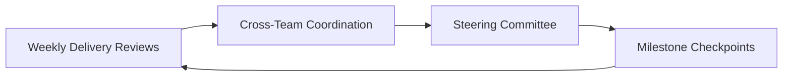

# Delivery Cadence

This section describes the meeting rhythms and checkpoints that help complex programs stay aligned during execution.

Programs need more than plans. They need a delivery cadence that creates regular visibility into status, risks, dependencies, and decisions.

A consistent cadence provides predictable opportunities for teams and leadership to review progress, resolve blockers, and maintain alignment across workstreams.

## Common Cadence Elements

Delivery cadence varies across organizations, but most complex programs include a combination of the following coordination points.

### Weekly Delivery Review

Focus on execution progress, blockers, and near-term milestones across delivery teams.

| Element | Guidance |
|---|---|
| **Typical participants** | Program lead, project/program managers, workstream or delivery leads |
| **Primary purpose** | Review execution progress and identify issues affecting near-term delivery |
| **Prepare offline** | Status updates, milestone progress, and routine issue resolution should be reviewed before the meeting |

### Cross-Team Coordination

Review dependencies, handoffs, and shared issues across workstreams or teams.

| Element | Guidance |
|---|---|
| **Typical participants** | Program lead, workstream leads, technical or product leads responsible for interdependent work |
| **Primary purpose** | Coordinate dependencies, resolve handoffs, and align teams on shared milestones |
| **Prepare offline** | Teams should identify dependencies, clarify handoffs, and bring unresolved coordination issues |

### Steering Committee Reviews

Provide governance oversight and address major risks, escalations, or decisions requiring leadership input.

| Element | Guidance |
|---|---|
| **Typical participants** | Executive sponsor, steering committee members, program lead |
| **Primary purpose** | Review program health, address escalated risks, and approve major decisions |
| **Prepare offline** | Program reporting, risk summaries, and decision recommendations should be prepared in advance |

### Milestone Checkpoints

Assess readiness and alignment at key delivery points during the program lifecycle.

| Element | Guidance |
|---|---|
| **Typical participants** | Program leadership, relevant workstream leads, and stakeholders responsible for milestone deliverables |
| **Primary purpose** | Confirm readiness to proceed to the next phase of delivery |
| **Prepare offline** | Deliverables, validation activities, and milestone criteria should be reviewed prior to the checkpoint |

## Benefits of Strong Cadence

A consistent delivery cadence helps teams:

- stay aligned across teams and workstreams
- surface risks and blockers early
- maintain delivery momentum
- reinforce ownership and accountability
- support timely decision-making

Cadence is one of the simplest and most effective tools for maintaining program discipline and execution visibility.

---
---

Part of the Transformation Operating Framework  
https://github.com/somerwalker/transformation-operating-framework

Copyright © 2026 Somer Walker

This material is provided for educational and professional reference.  
Commercial use or derivative consulting frameworks requires permission from the author.
