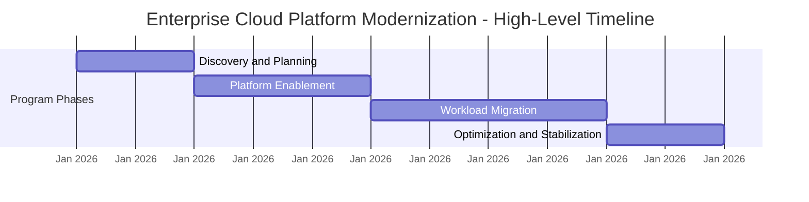

# Example Program Charter

This example illustrates how a program charter can formalize an initiative after program intake and stakeholder alignment.

The program charter defines the purpose, scope, leadership, and success criteria for a program before detailed execution planning begins. It provides a shared reference point for stakeholders and establishes the foundation for governance, coordination, and reporting structures used during execution.

---

## Program Overview

**Program Name**  
Enterprise Cloud Platform Modernization

**Program Objective**  
Modernize the organization's infrastructure platform by migrating legacy workloads to a secure, scalable cloud environment while improving deployment speed, reliability, and operational efficiency.

**Business Context**  
The organization currently operates multiple legacy infrastructure environments that increase operational complexity, slow application delivery, and limit scalability. Modernizing the infrastructure platform will enable faster product development, improved reliability, and stronger alignment with long-term technology strategy.

---

## Program Scope

**In Scope**

- migration of selected legacy workloads to cloud infrastructure  
- implementation of shared cloud platform services  
- improvements to deployment pipelines and infrastructure automation  
- modernization of infrastructure monitoring and operational tooling  

**Out of Scope**

- redesign of application architectures not directly affected by migration  
- major feature development unrelated to infrastructure modernization  
- changes to product roadmaps outside infrastructure dependencies  

---

## Program Leadership

**Executive Sponsor**  
Chief Technology Officer

**Program Lead**  
Director of Technology Programs

**Key Stakeholders**

- Infrastructure Engineering  
- Platform Engineering  
- Security Engineering  
- Product Engineering  
- IT Operations  

Participating teams are responsible for delivering components of the program within their respective domains while coordinating through program governance structures.

---

## Success Criteria

The program will be considered successful if it achieves the following outcomes:

- targeted legacy systems successfully migrated to cloud infrastructure  
- improved deployment frequency and reduced release cycle time  
- improved platform reliability and operational visibility  
- reduced operational overhead for infrastructure management  

These outcomes align the program with broader organizational technology and product delivery goals.

---

## High-Level Timeline

The program is expected to progress through the following phases:

**Phase 1 — Discovery and Planning**  
Assess workloads, define migration approach, and establish delivery structures.

**Phase 2 — Platform Enablement**  
Deploy foundational cloud services, security controls, and operational tooling.

**Phase 3 — Workload Migration**  
Migrate prioritized workloads to the cloud platform in coordinated waves.

**Phase 4 — Optimization and Stabilization**  
Improve automation, monitoring, and operational processes following migration.

In practice, these phases may overlap or repeat as different workstreams progress through the program lifecycle.

---

## Program Governance

Program execution will follow the governance and coordination structures described in the Program Execution OS.

Key elements include:

- program leadership and decision authority  
- cross-team coordination structures  
- risk management processes  
- executive reporting  
- delivery cadence and checkpoints  

These mechanisms ensure alignment across participating teams and maintain visibility for executive stakeholders.

---

## Next Steps

Following charter approval, the program leadership team will:

- establish detailed execution plans  
- confirm workstreams and delivery teams  
- define milestones and dependency coordination  
- initiate governance and delivery cadence structures  

These execution activities are supported by the frameworks and templates provided in this repository.

---
---

Part of the ***Transformation Operating Framework***  

Transformation Operating Framework
https://github.com/somerwalker/transformation-operating-framework

Copyright © 2026 Somer Walker

This material is provided for educational and professional reference.  
Commercial use or derivative consulting frameworks requires permission from the author.
