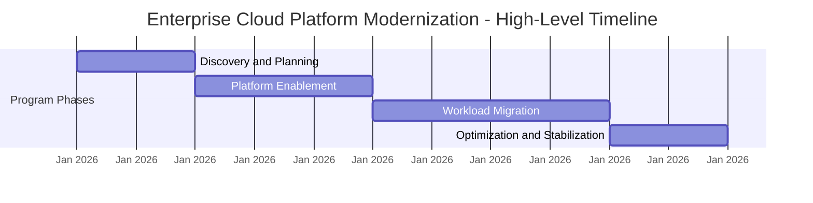

# Example Program Charter

This example illustrates how a program charter formalizes a program after the intake process and stakeholder alignment.

The charter defines the program at a high level and establishes the leadership, scope boundaries, and success criteria that will guide execution.

---

## Program Overview

**Program Name**  
Enterprise Cloud Platform Modernization

**Executive Sponsor**  
Chief Technology Officer

**Program Lead**  
Director of Technology Programs

---

## Program Objective

Modernize the organization's infrastructure platform by migrating legacy workloads to a secure and scalable cloud environment while improving deployment speed, reliability, and operational efficiency.

---

## Business Context

The organization currently operates multiple legacy infrastructure environments that increase operational complexity and slow application delivery.

Modernizing the infrastructure platform will enable faster product development, improved reliability, and stronger alignment with long-term technology strategy.

---

## Scope Boundaries

### In Scope

- migration of prioritized legacy workloads to cloud infrastructure  
- implementation of shared cloud platform services  
- improvements to deployment automation and infrastructure tooling  

### Out of Scope

- redesign of application architectures unrelated to migration  
- feature development not tied to infrastructure modernization  

---

## Participating Teams

The following teams contribute to program delivery:

- Infrastructure Engineering  
- Platform Engineering  
- Security Engineering  
- Product Engineering  
- IT Operations  

---

## Success Criteria

The program will be considered successful if it achieves the following outcomes:

- prioritized legacy systems successfully migrated to cloud infrastructure  
- improved deployment frequency and reduced release cycle time  
- improved platform reliability and operational visibility  
- reduced operational overhead for infrastructure management  

---

## High-Level Timeline

---

## Execution Governance

Program execution will follow the governance and coordination structures described in the Program Execution OS, including:

- program governance and decision authority  
- cross-team coordination mechanisms  
- risk management processes  
- executive reporting  
- delivery cadence

These structures ensure alignment across participating teams and maintain visibility for executive leadership.

---

Part of the **Transformation Operating Framework**

Transformation Operating Framework  
https://github.com/somerwalker/transformation-operating-framework

Copyright © 2026 Somer Walker

This material is provided for educational and professional reference.  
Commercial use or derivative consulting frameworks requires permission from the author.
