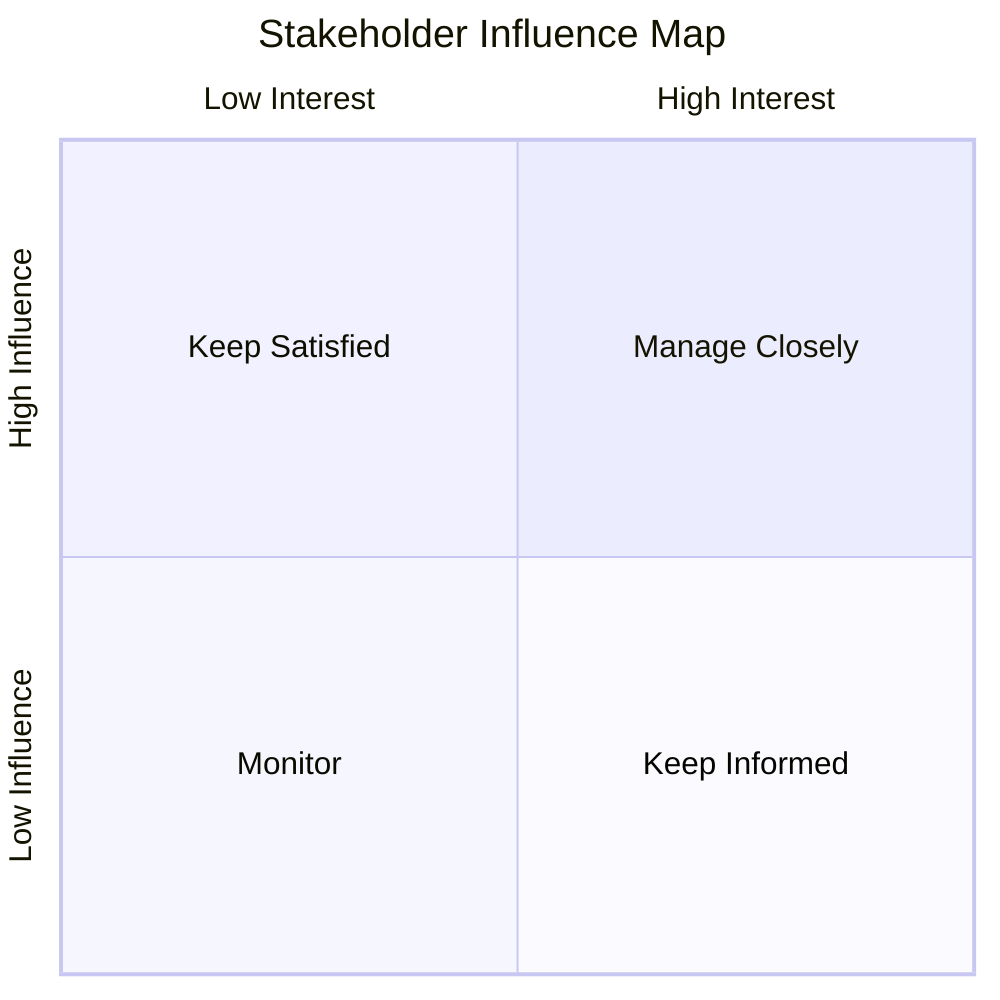

# Stakeholder Map Template

This template helps program leaders identify and understand the individuals and groups who influence program success.

Stakeholder mapping clarifies who must be informed, consulted, or actively involved throughout program delivery. A clear understanding of stakeholder roles and influence helps programs maintain alignment, avoid communication gaps, and escalate issues effectively.

## Stakeholder Map

| Stakeholder | Role | Organization / Team | Influence Level | Engagement Approach |
|---|---|---|---|---|
| | | | High / Medium / Low | |
| | | | | |
| | | | | |

## Field Guidance

| Field | Description |
|---|---|
| Stakeholder | Individual or group involved in or affected by the program |
| Role | Their role in relation to the program |
| Organization / Team | The group or department they represent |
| Influence Level | Their ability to affect program decisions or outcomes |
| Engagement Approach | How the program team should communicate or collaborate with them |

## Stakeholder Influence Grid

Programs often prioritize stakeholders based on their **level of influence** and **level of interest in the program**.

Stakeholders with both **high influence and high interest** should be closely engaged throughout the program.  
Stakeholders with lower influence may require less frequent updates but should still be kept informed of major developments.

## Usage

Stakeholder maps are typically created during **program intake or early planning** to ensure the right stakeholders are identified before execution begins.

Understanding stakeholder influence and expectations helps program leaders:

- coordinate communication across teams
- ensure appropriate leadership involvement
- align expectations early
- reduce decision delays
- support effective governance

---
---

Part of the Transformation Operating Framework  
https://github.com/somerwalker/transformation-operating-framework

Copyright © 2026 Somer Walker

This material is provided for educational and professional reference.  
Commercial use or derivative consulting frameworks requires permission from the author.
